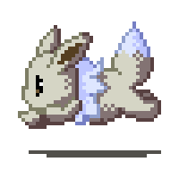

  <samp>
    <b>
      データサイエンティスト
       
      Olá, meu nome é Letícia ♡ !
       

      
 
 
      

  

  &nbsp;&nbsp;&nbsp;&nbsp;&nbsp;&nbsp;

  

 

    

      <samp>
        <b>More Info</b>
      </samp>
    

     

  |  |  |  |
| :-: | :-: | :-: |

  |  |  |
| :-: | :-: |
  

 
  
  
  
  
  
  
  
  
  
  
  
  

 

##

 

  
  
  
  
  
  
  
  

##

 
 

